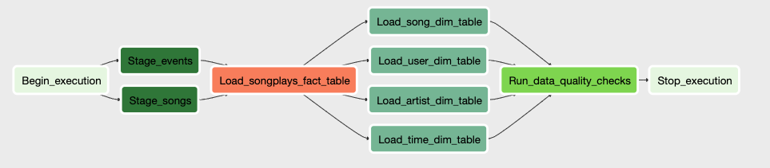

# Data-Pipeline-Project

## Project Description

A music streaming company, Sparkify, has decided that it is time to introduce more automation and monitoring to their data warehouse ETL pipelines and come to the conclusion that the best tool to achieve this is Apache Airflow.

They have decided to bring you into the project and expect you to create high grade data pipelines that are dynamic and built from reusable tasks, can be monitored, and allow easy backfills. They have also noted that the data quality plays a big part when analyses are executed on top the data warehouse and want to run tests against their datasets after the ETL steps have been executed to catch any discrepancies in the datasets.

The source data resides in S3 and needs to be processed in Sparkify's data warehouse in Amazon Redshift. The source datasets consist of JSON logs that tell about user activity in the application and JSON metadata about the songs the users listen to.

## Project structure
```
|____create_tables.sql         # Create tables statements
|____README.md                 # Info about the project
|
|____dags
| |____ udac_example_dag.py    # Dag that loads the data from S3 to Redshift
|
|____plugins
| |____ __init__.py            # Define helpers
| |
| |____operators
| | |____ __init__.py          # Define operators
| | |____ stage_redshift.py    # COPY/Stages data from S3 to Redshift
| | |____ load_fact.py         # Inserts data from staging into fact table
| | |____ load_dimension.py    # Inserts data from staging into dimension tables
| | |____ data_quality.py      # Runs data quality checks
| | |____ create_tables.py     # Creates tables if necessary
| |
| |____helpers
| | |____ __init__.py          # Defines Plugins
| | |____ sql_queries.py       # SQL queries to insert data into facts and dimensions tables
```

## DB Design

The schema design is based on the concept of a star schema. It is desgined to analyse the data regarding song playing.
This type of modeling takes advantage of denormalization and fast aggregation.
It will help Sparkify answer their questions with fast and reliable data.

## Tables 

### Fact Table

1. **songplays** - records in log data associated with song plays
   * songplay_id, start_time, user_id, level, song_id, artist_id, session_id, location, user_agent

### Dimension Tables

2. **users** - users in the app
   * user_id, first_name, last_name, gender, level

3. **songs** - songs in music database
   * song_id, title, artist_id, year, duration

4. **artists** - artists in music database
   * artist_id, name, location, latitude, longitude

5. **time** - timestamps of records in songplays broken down into specific units
   * start_time, hour, day, week, month, year, weekday

## DAG/Pipeline Overview



## Tasks

1. `Begin_execution` - Creates tables in Redshift in case they do not exists
2. `Stage_events` & `Stage_songs` - Copies data from s3 to stage tables in Redshift
3. `Load_songplays_fact_table` - Loads songplays data from staging to fact table
4. `Load_<table_name>_dim_table` - Loads dimension data from staging tables to dimension tables
5. `Run_data_quality_checks` - Runs quality checks on the facts and dimensions tables
6. `Stop_execution` - Dummy operator

## How to run 

Due to dependencie errors it was not possible to setup airflow locally and test the DAG.
The Udacity airflow online build was used

1. Create a IAM user with admin permission for S3 and Redshift
2. Create a Redshift cluster
3. Turn on airflow by running `/opt/airflow/start.sh`
4. Create connection variables in airflow
5. Create AWS 
6. Run `udac_airflow_dag` DAG to start the ETL process
7. Check the data with:
   1. An IDE like Datagrip and connect to the cluster
   2. Use aws console redshift query editor
8. Delete/Turn of resources


## References

* [Apache Airflow Quickstart](https://airflow.apache.org/docs/apache-airflow/stable/start.html) 
* [Examples of using the Amazon Redshift Python connector](https://docs.aws.amazon.com/redshift/latest/mgmt/python-connect-examples.html) 
* [How to read a SQL file with python with proper character encoding?](https://stackoverflow.com/questions/47705183/how-to-read-a-sql-file-with-python-with-proper-character-encoding)
